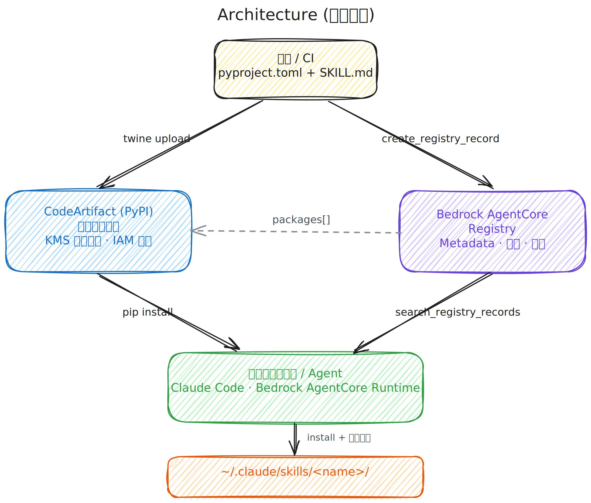

# agentcore-private-registry-blueprint

> 🌐 **中文（本页）** · [English](./README.en.md)

在 AWS 上搭建**企业私有、可治理的 AI 资源注册中心**的参考实现——基于 Amazon Bedrock AgentCore Registry + AWS CodeArtifact。

- **Day 1**：端到端可运行的 Skills 演示。一键 CDK 部署，含一个真实 skill，可被 Claude Code 自动发现。
- **Day N**：同一套 Registry 还能注册 MCP servers、A2A agents、知识库、Lambda 工具、Bedrock Guardrails、Cedar 策略、评测数据集等任意自定义资源。详见 [docs/07](docs/07-extending-to-other-resources.md)。

**状态**：Preview 阶段（2026-05）。AWS Agent Registry 仍在 public preview，API 可能变更。

---

## 为什么做这个

两个产品在 2026 年中前会被企业接连用上：

- **Bedrock AgentCore Registry**（preview，2026-04）—— Agent 资源的私有目录服务，原生承载 agents、MCP、skills 与自定义资源。
- **CodeArtifact** —— 与前者天然配套的私有制品仓库。

两者合用解决了一个仍未被普遍提出但即将成为问题的需求：**AI 资源已经是企业 IP，需要与代码、基础设施、数据同级的治理**。

Day-1 演示聚焦 **Skills**，因为隐私论点在这里最锋利。Skill 不是 prompt，是 agent 可直接执行的 SOP——财务分析、事故排查、数据探索、合规审查的方法论被代码化。这把"放哪里、谁能发"变成真问题：

- **隐私性** —— 财务分析 skill 嵌入毛利口径、客户分级、定价规则。**不能放公网 marketplace 或公网 GitHub**。
- **合规** —— MAS / HKMA / PBOC、HIPAA、欧盟 AI Act 把 agent 可执行指令视为可审计产物，需要版本化、审批留痕、不可变历史。
- **规模化可发现** —— 50+ skill 之后，搜索和信任信号的价值超过 Confluence 里的 git URL。

公网 skill 市场（Anthropic、`skills.sh`）和自托管玩具项目（iflytek SkillHub）都不满足企业约束。本仓库给出 AWS Agent Registry + CodeArtifact 的具体接法——含一键 CDK 与可在你自家 Claude Code 上验证的示例。

[→ 完整论证：`docs/01-why-private-skills.md`](docs/01-why-private-skills.md)

## 架构（一分钟版）

<p align="center">
  
</p>

四个角色：**作者 / CI** 把 skill 推到两个后端——制品（PyPI wheel）入 CodeArtifact，metadata 入 Agent Registry。**消费方**（开发者或 Claude Code / AgentCore Runtime）通过 Registry 搜索，按返回 metadata 里的 `packages[]` 指针从 CodeArtifact `pip install`，落到 `~/.claude/skills/<name>/`，下一个 prompt 自动发现。

[→ 完整架构：`docs/02-architecture.md`](docs/02-architecture.md)

## 蓝图覆盖范围

**Day-1（端到端验证过）**：

| 关注点 | AWS 服务 | 本仓库提供 |
|---|---|---|
| 发现 + 治理 | Bedrock AgentCore Registry | 创建 registry 的 CDK；发布/审批 record 的 Python 脚本；`skillDefinition` 参考 schema |
| 制品存储 | CodeArtifact（PyPI） | 创建 domain + repo 的 CDK；纯文本 skill 的 `pyproject.toml` 模板 |
| Skill 格式 | (SKILL.md 规范) | 示例 `aws-cost-anomaly-triage`：frontmatter + 6 个资源文件 |
| 激活 | (消费侧) | `postinstall.py` 控制台脚本 + `04_consume_skill.py` 跑通 search → install → activate |
| 一键部署 | AWS CDK (TypeScript) | `cdk deploy --all` 约 3 分钟 |
| 认证 | IAM 当下；JWT/OIDC 已落地 | IAM 路径可跑；Cognito JWT 路径见 docs/10 |

**Day-N（已文档化，可扩展）**：

同一个 Registry 承载 4 种 `descriptorType`，本蓝图演示 `AGENT_SKILLS`，其余三种地位平等：

| `descriptorType` | 装什么 | Schema |
|---|---|---|
| `AGENT_SKILLS` | 可复用 SOP（本演示） | SKILL.md + skillDefinition v0.1.0 |
| `MCP` | MCP servers / tools | MCP server.json |
| `A2A` | Agents | Google A2A Agent Card |
| `CUSTOM` | 其他（KB、Lambda、Guardrail、Cedar、SFN、评测集、schema 等） | 自定义 JSON |

[docs/07](docs/07-extending-to-other-resources.md) 给了一个 18 record 的"客服中心"完整示例，跨全部四种 `descriptorType`。

## 10 分钟跑通

```bash
# 1. 部署基础设施（CodeArtifact domain + repo，Agent Registry）
cd cdk && npm install && npx cdk deploy --all

# 2. 构建并发布示例 skill
cd ../skill-package && python3 -m build
aws codeartifact login --tool twine --domain skills-demo --repository skills-prod --region us-east-1
python3 -m twine upload --repository codeartifact dist/*

# 3. 注册、审批、消费
cd ../scripts
python3 02_register_skill.py
python3 03_approve_skill.py
sleep 30   # 搜索索引在审批通过后约 15-30 秒命中
python3 04_consume_skill.py
```

跑完第 3 步，`~/.claude/skills/aws-cost-anomaly-triage/` 已生成；Claude Code 下一个 prompt 自动列出该 skill。

## 作者怎么发布——`publish-skill`（发 skill 的 skill）

仓库里有一个特殊 skill：**`skills/publish-skill/`**。它本身是 skill，但作用是帮其他作者发布 skill。装到 `~/.claude/skills/` 后，作者只需在 Claude Code 里说"把这个 skill 发布出去"，整套 build → upload → 注册 → 提审就被自动驱动。

```bash
# 一次性配置（每台机器一次）
mkdir -p ~/.skillpublish && cat > ~/.skillpublish/config.toml <<'EOF'
[default]
region = "us-east-1"
codeartifact_domain = "skills-demo"
codeartifact_repository = "skills-prod"
registry_name = "skills-demo-registry"
EOF

# 每次发新 skill
cd path/to/your-new-skill/      # 包含 pyproject.toml + src/<pkg>/skill_files/SKILL.md
# 在 Claude Code 里说："publish this skill"
```

**权限由 IAM 控制，与 skill 本身无关**。即便 publish-skill 装到了机器上，缺 `codeartifact:PublishPackageVersion` 和 `bedrock-agentcore:CreateRegistryRecord` 的人会被 IAM 拒绝——这是真护栏，skill 只是降低操作门槛的便利层。

> **关于 Reader（普通终端用户）**：上述 IAM 模型适用于 Publisher / Curator / Admin 这种少量、可信、有 AWS 凭据的角色。**业务用户、分析师、客服坐席**这种大规模、不应持有 IAM 凭据的人群，走 **Cognito User Pool + Identity Pool** 的 JWT-换-临时-凭据路径——他们机器上零 AWS 配置文件，凭据存 OS keyring，体验是"浏览器登录一次，30 天透明可用"。详见 [docs/10](docs/10-end-user-access.md)。

四类角色与对应 IAM 策略详见 [docs/09](docs/09-publishing-iam.md)：
- **Reader**：所有人，搜索 + 安装已审批 skill
- **Publisher**：限定团队的作者，创建 + 提审
- **Curator**：少数人，审批（按职责分离，**Publisher 不能审自己**）
- **Admin**：极少数，管 registry 本身

作者侧文档：[docs/08](docs/08-publishing-workflow.md)。

## 心智模型——Registry 是什么、不是什么

最常见的误解是把 Registry 当"skill 下载服务"。**它不是**——把这点想清楚，后面的设计就顺了。

**Registry 是 metadata 的发现 + 治理服务，不托管制品，也不安装任何东西**。它的 MCP 端点只暴露**一个**工具：

```
search_registry_records(searchQuery, maxResults, filter)
```

没有 `install`，没有 `download`，没有 `activate`。这是故意的。和 npm 类比：

| | npm 生态 | Agent Registry 生态 |
|---|---|---|
| 搜索服务 | `registry.npmjs.org` | Agent Registry MCP endpoint |
| 搜索命令 | `npm search` | `search_registry_records` |
| 安装命令 | `npm install`（CLI 客户端跑） | `pip install`（Claude Code 的 Bash 工具跑） |
| 本地安装目录 | `~/.node_modules/` | `~/.claude/skills/` |
| 自动加载已装 | Node `require()` 解析 | Claude Code 每次 prompt 扫 `~/.claude/skills/` |

Claude Code 用一个私有 skill 时，**三件相互独立的事在发生**——它们设计上解耦：

```
1. 发现（远程，仅 metadata，KB 量级）
   Claude Code → Registry MCP → search_registry_records
   返回：SKILL.md + packages[] 指针；不传输任何制品

2. 决策（Claude 推理，无 API 调用）
   读 skillMd 后选：
     (a) 一次性使用 → 内嵌 SKILL.md 进对话上下文
     (b) 持久安装 → 通过 Bash 工具触发 pip install
     (c) 跳过 → 本地已经装过

3. 安装（仅 2b 时发生，Claude Code 自带 Bash 工具执行）
   pip install <包> 从 CodeArtifact + post-install 拷贝
   幂等：同版本再跑一次 pip install 是 no-op
```

Registry 永远不会**主动推送** skill 到你机器；Registry 也**不知道**你本地装过哪些 skill。这两件事归 agent runtime 与消费脚本管。

> **同样的解耦也适用于服务端**：Registry 不感知 record 描述的资源**跑在哪里**。一个 `MCP` record 的 server 可以在 AgentCore Runtime / Lambda / ECS / 自家 K8s / GovCloud / 别人家 GCP，Registry 只索引 metadata、做治理。这是 AWS 在公告里反复强调的"works with any MCP Server, Agent, Skill or Custom Resource, deployed on AWS, On-Prem or on any other Cloud environment"——把 Registry 当成跨环境的目录，而不是 AWS 内部的运行时附属物。

### 两层"发现"机制并行运转

```
┌──────────────────────────────────────┐
│ 远程层                                │
│ Registry MCP / SDK                    │
│ → 返回组织已审批目录的 metadata        │
│ → 不感知本地文件系统                   │
└──────────────────────────────────────┘
                 ┊  互不通信
                 ┊
┌──────────────────────────────────────┐
│ 本地层                                │
│ Claude Code / Bedrock Runtime         │
│ → 每个 prompt 扫 ~/.claude/skills/    │
│ → 不感知 Registry 存在                 │
└──────────────────────────────────────┘
```

昨天装好的 skill 今天**本地层立即可见，零远程调用**。团队刚发布的新 skill **远程层立即可搜，本地无变化**——除非有人主动安装。

### 每种交互的成本

| 场景 | 实际跑了什么 | 网络字节 |
|---|---|---|
| Skill 已在 `~/.claude/skills/` | 本地扫描 | 0 |
| 搜到 skill，Claude 内嵌进上下文一次性用 | `search_registry_records` | ~5KB metadata |
| 搜到 → 决定安装 | search + 从 CodeArtifact pip install | ~5KB metadata + ~15KB wheel |
| 同版本重新装 | `pip install` 走本地缓存 no-op | 0 |
| Registry 是 v0.2.0、本地是 v0.1.0 | search + `pip install --upgrade` | metadata + 增量 |

调用是 KB 级 metadata 查询，不是制品传输——所以"每次对话都调一下 Registry"完全可接受。

## 仓库布局

```
.
├── README.md                          # 当前文件（中文）
├── README.en.md                       # 英文版
├── docs/
│   ├── 01-why-private-skills.md            # 企业级动因
│   ├── 02-architecture.md                  # 服务映射 + 图
│   ├── 03-demo-walkthrough.md              # 4 个脚本流程 + 时序
│   ├── 04-dynamic-discovery.md             # MCP endpoint：Claude Code 怎么发现 skill
│   ├── 05-auth-placeholder.md              # auth 入口（指向 09 + 10）
│   ├── 06-future-optimizations.md          # 跨账号、KMS CMK、EventBridge、OCI 等
│   ├── 07-extending-to-other-resources.md  # MCP、KB、Lambda、Guardrail 等
│   ├── 08-publishing-workflow.md           # 作者视角发布工作流
│   ├── 09-publishing-iam.md                # 平台团队视角四档 IAM 策略
│   └── 10-end-user-access.md               # 终端用户走 Cognito 不要 IAM 凭据
├── cdk/                               # 一键 TypeScript CDK
│   ├── bin/blueprint.ts
│   ├── lib/codeartifact-stack.ts
│   ├── lib/registry-stack.ts
│   ├── lib/identity-stack.ts          # 可选 Cognito 层
│   └── package.json
├── skill-package/                     # 可发布的示例 skill
│   ├── pyproject.toml
│   └── src/aws_cost_anomaly_triage/
│       ├── postinstall.py
│       └── skill_files/
│           ├── SKILL.md
│           └── resources/*.md
├── skills/                            # 蓝图自带的 meta-skill 与客户端
│   ├── publish-skill/                 # 发 skill 的 skill
│   └── skill-cli/                     # 终端用户 JWT→IAM 桥接 CLI
├── scripts/                           # boto3 publish/approve/consume（Day-1）
│   ├── 01_create_registry.py
│   ├── 02_register_skill.py
│   ├── 03_approve_skill.py
│   └── 04_consume_skill.py
└── examples/                          # Day-N 示例
    ├── cognito-end-to-end/            # ✅ 已验证 Cognito + Identity Pool 端到端
    ├── mcp-server/                    # 📘 documented stub
    ├── knowledge-base/
    ├── lambda-tool/
    └── guardrail/
```

## 各部分状态

**Day-1（Skills，端到端）**：

| 模块 | 状态 |
|---|---|
| CodeArtifact + Agent Registry CDK | ✅ |
| `aws-cost-anomaly-triage` 示例 skill | ✅ |
| 发布 + 审批 + 消费脚本 | ✅ 端到端测过 |
| MCP endpoint 动态发现 | ✅ 文档 + 客户端配置示例 |
| IAM 认证 | ✅ |
| `publish-skill` meta-skill（参数化发布器 + 四档 IAM） | ✅ 脚本通过 preflight；docs/08+09 |
| 终端用户访问（Cognito → Identity Pool → 临时 IAM） | ✅ CDK 通过 cdk synth；`skill-cli` 客户端可工作；docs/10；**`examples/cognito-end-to-end/` 端到端实跑过**（含正反两路） |

**Day-N 扩展**：

| 模块 | 状态 |
|---|---|
| MCP server records (`descriptorType: MCP`) | 📘 docs/07 + `examples/mcp-server/` |
| Knowledge Base records (CUSTOM) | 📘 docs/07 + `examples/knowledge-base/` |
| Lambda 工具 records (CUSTOM) | 📘 docs/07 + `examples/lambda-tool/` |
| Bedrock Guardrails records (CUSTOM) | 📘 docs/07 + `examples/guardrail/` |
| Registry MCP endpoint **直接** JWT（CustomJWTAuthorizer 接非 Cognito IdP） | 🔶 Phase 2，docs/05 |
| 跨账号消费 | 🔶 Phase 2 |
| CodeArtifact KMS CMK | 🔶 Phase 2 |
| EventBridge → Slack 审批流水线 | 🔶 Phase 2 |
| OCI 制品分发 | ⏸ 等 agentskills/agentskills 规范定稿 |
| GitHub Actions 合并即发布 CI | ⏸ Phase 2 |

[→ 路线图：`docs/06`](docs/06-future-optimizations.md)

## 为什么是现在（一个 SA 视角）

两个时点叠加构成 2026-Q2 这个窗口：

1. **AWS Agent Registry 刚发布（2026-04 preview）**，AWS 自己还没出把它和 CodeArtifact 串起来做 skill 分发的官方 sample，本仓库以验证过的端到端代码补这个空白。
2. **Skills 作为企业 IP 是真问题，但多数团队还没撞上**。第一波"我的私有 skill 放哪里"的客户问询正在这段时间发生——手里有可跑蓝图意味着对话从"让我研究一下"变为"这个仓库，按你的 IdP 改一下"。

本仓库在 AWS 文档没明说处刻意有立场：纯文本与脚本类 skill 推荐 **CodeArtifact 作为制品后端**；**IAM 是 day-1 路径，JWT/OIDC 是 day-2**；**Registry 应承载所有可治理 AI 资源**，不仅 skill。不同意？欢迎开 issue。

## 灵感 / 相关工作

- AWS Agent Registry 公开文档与 2026-04 preview 发布 blog
- Pinterest "中心 registry + paved path" MCP 架构（ByteByteGo 解读）
- ToolHive / Stacklok Enterprise（MCP 工具方向 production-ready 对应物）
- iflytek/skillhub（反面案例：协议选错赛道）
- Anthropic `anthropics/skills`（格式定义）

## License

Apache 2.0。详见 [LICENSE](LICENSE)。

## 免责

作者是 AWS Solutions Architect；这是个人蓝图，**不是 AWS 官方发布的参考架构**，未经 Amazon 内部安全或法务审查。投产前请按你账号实际合规要求验证。
